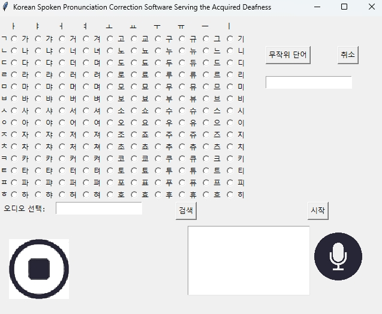
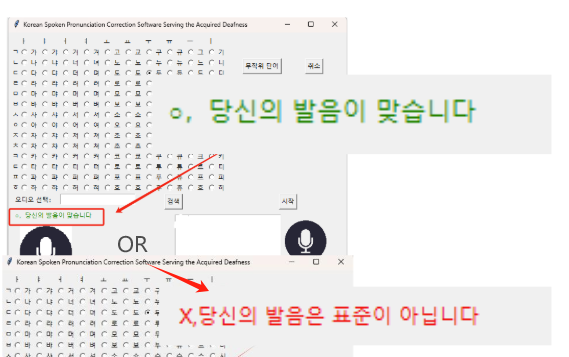

# Korean-Pronunciation-Test

### Introduction

  This project is a software that can judge and correct the correctness of Korean pronunciation for people with acquired hearing loss and Korean learners.

### For Users

1. If you want to use our software, please clone our entire code to your Windows computer, or download the compressed package from the Release page, and run the 'gui_show.py' file in Python.

   Then you can see the interface displayed as follows.

​    2.Then, you can click any letter on the right to record in real time. Please keep your environment quiet. Click again to end the recording. Your voice will be compared with the standard recording file I prepared through the model. If the similarity is higher than the preset value, it will be displayed as passed. If the similarity is lower than the preset value, it will be displayed as failed. As shown in the figure below:

 Users can try again and again until they can stably pronounce the correct pronunciation.

 3. If you want to try to test whether the pronunciation of the word is accurate or not, you need to click the '무작위 단어' button and randomly select a word from our word library, and then perform the voice judgment operation. It is worth noting that due to the limitations of Tkinter, when you want to switch from word recognition to single character recognition, you must click the '취소' button on the right and select a single character for testing.

 4. You can also choose to compare the existing recording file with the standard file to get the result. Just select a local file in '오디오 선택'.

### Development Environment

  Version3.7 

(Since the TensorFlow we use only supports Python version 3.7, the correct version is necessary)

### Team Members & Division of Labor

- Members:하만기/창쓰퉁/조성우.

- Division:
  - 하만기:Work and code writing on the training and application parts of the model.Writing of technical documentation.
  
  - 창쓰퉁:Writing the code for the GUI part.
  
  - 조성우:Writing some GUI codes. Testing and fixing bugs.
  
    (The above are the main tasks performed by each person. In fact, the division of work is not absolute.)

### Developer Documentation

https://docs.google.com/document/d/1QNoS7zU03u55hK5G0X0ReJQseJ4lFcKtRxSsyTSsEbM/edit?usp=sharing

### Some Regrets

- Due to limited team members and time, and some problems we encountered during development, we did not complete the expected development of the WEB UI. In the original idea, we hoped that after the user reads the wrong pronunciation once, the correct pronunciation of the mouth shape and text description will be displayed in the software interface to help users learn and master the correct pronunciation better and faster. For this purpose, we also downloaded the standard reading mouth shape video of the words in our prepared word library from the Korean 국립국어원. Our team may develop the WEB UI in the future when we have time. You are also welcome to continue the development based on our work and upload it to our code repository. I put these videos on our network disk and named them clearly. You can download them through the link below.

  Videos.rar

- In fact, we noticed the Korean AI hub website, which provides many high-quality Korean data sets, but downloading these files requires real-name authentication and is only available to Korean citizens. We were concerned about legal risks and chose not to try these data sets.Perhaps Korean citizens can download those datasets and train a more accurate model using the training method in our technical documentation to improve our software.
